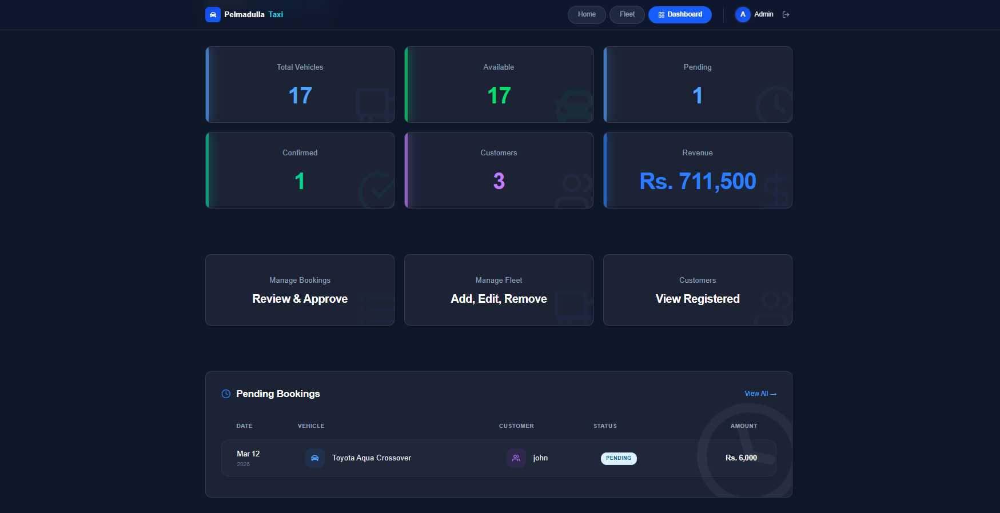
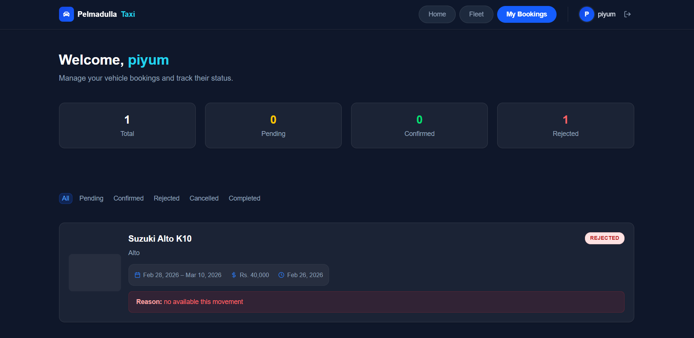
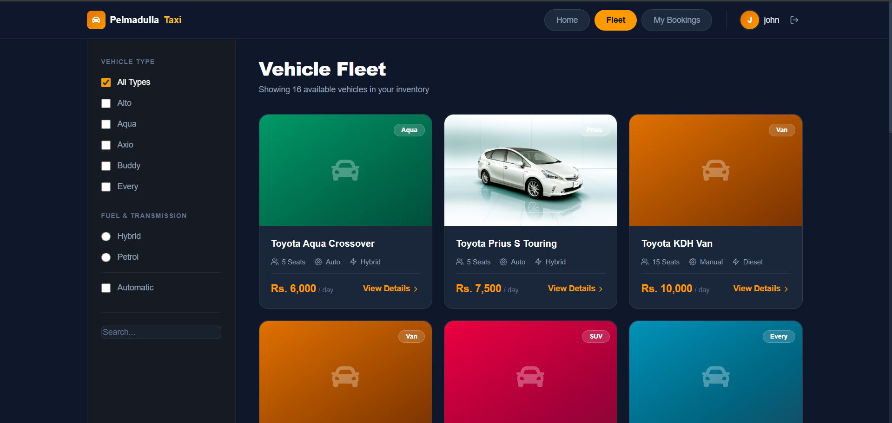

# Pelmadulla Taxi & Vehicle Booking System

> 🚧 **Work In Progress**: This project is currently under active development. Features and documentation are subject to change.

A full-stack web application for managing vehicle rentals and taxi bookings. This system provides distinct interfaces for customers to book vehicles and for administrators to manage the fleet, track bookings, and view business analytics.

## 🚀 Features

### For Customers
- **Fleet Browsing**: View available vehicles with categories and pricing.
- **Booking Management**: Create booking requests, track status (Pending, Confirmed, Rejected), and cancel pending requests.
- **User Profile**: Manage personal details and contact information.

### For Administrators
- **Dashboard Overview**: Visualized stats for total vehicles, revenue, customers, and active bookings.
- **Booking Control**: Review, confirm, or reject customer booking requests with reason notes.
- **Fleet Management**: Add, update, or remove vehicles from the system.
- **Customer Tracking**: View registered users and their details.

## 🛠 Tech Stack

- **Frontend**: React.js, Vite, Tailwind CSS v4, React Router 7
- **Backend**: Node.js, Express.js
- **Database**: MongoDB (Mongoose)
- **Authentication**: JWT (JSON Web Tokens)
- **State Management**: React Context API

## 📋 Getting Started

### Prerequisites
- Node.js (v18+)
- MongoDB (Local or Atlas)

### 1. Clone the repository
```bash
git clone <your-repo-link>
cd Vehicle-Booking
```

### 2. Server Setup
```bash
cd server
npm install
```
Create a `.env` file in the `server` directory (use `.env.example` as a template):
```env
PORT=5000
MONGO_URI=your_mongodb_connection_string
JWT_SECRET=your_jwt_secret
```
Start the server:
```bash
npm start
```

### 3. Client Setup
```bash
cd ../client
npm install
npm run dev
```

The application should now be running at `http://localhost:5173`.

## 📸 Screenshots

### Admin Dashboard


### Customer Dashboard


### Fleet Browsing

